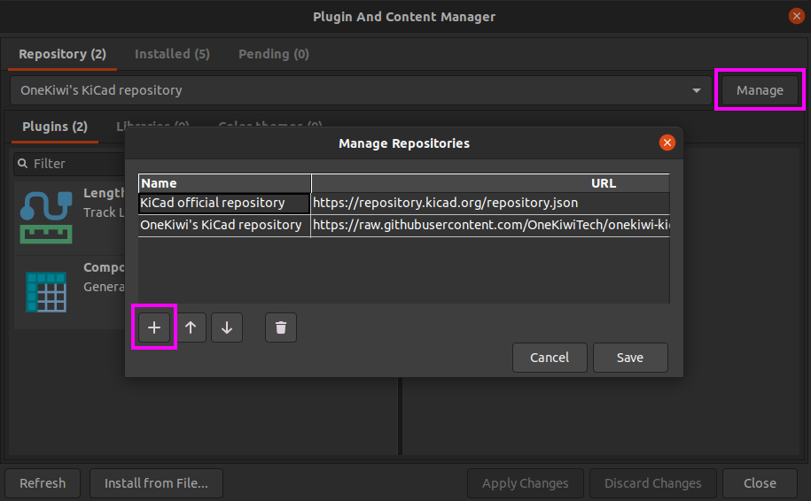

#  Fanout Tool

##

##

## GUI

## Installation 💾

Add our custom repo to **the Plugin and Content Manager**, the URL is `https://raw.githubusercontent.com/OneKiwiTech/onekiwi-kicad-repository/main/repository.json`

From there you can install the plugin via the GUI.

## Demo Video

## Licence and credits
Plugin code is licensed under MIT license, see LICENSE for more info.  
KiCad Plugin code/structure from:
- [kicad-jlcpcb-tools](https://github.com/Bouni/kicad-jlcpcb-tools)
- [wiki.wxpython.org](https://wiki.wxpython.org/ModelViewController)