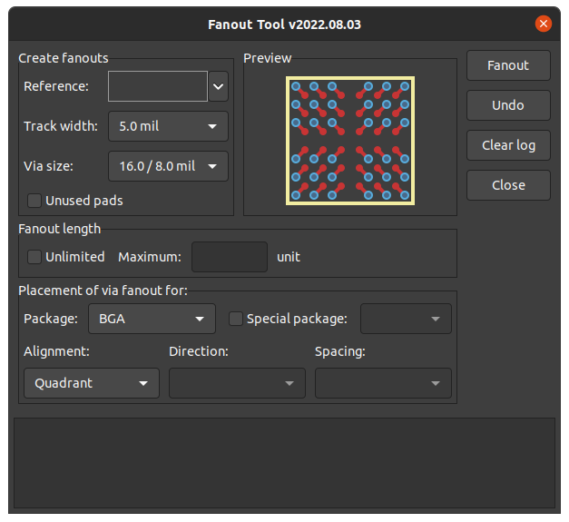

# Fanout Tool
  
BGA Fanout

## GUI

## Installation 💾

// TODO

## Demo Video

## Licence and credits
Plugin code is licensed under MIT license, see LICENSE for more info.  
KiCad Plugin code/structure from:
- [kicad-jlcpcb-tools](https://github.com/Bouni/kicad-jlcpcb-tools)
- [wiki.wxpython.org](https://wiki.wxpython.org/ModelViewController)
